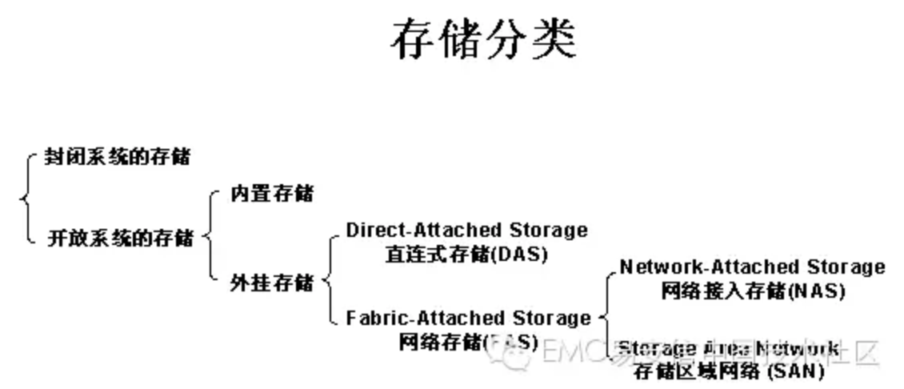
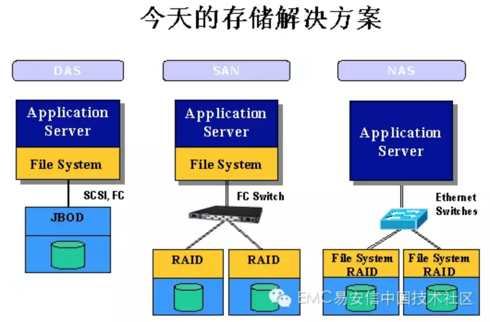
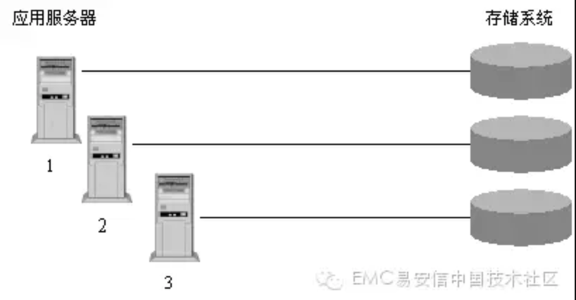
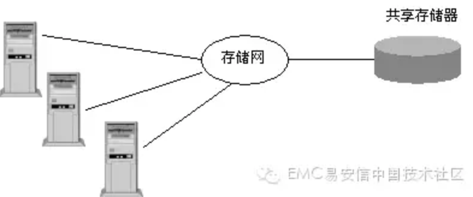

# NAS与SAN的区别

目前磁盘存储市场上，存储分类（如下表一）根据服务器类型分为：封闭系统的存储和开放系统的存储，封闭系统主要指大型机，AS400等服务器，开放系统指基于包括Windows、UNIX、Linux等操作系统的服务器；开放系统的存储分为：内置存储和外挂存储；开放系统的外挂存储根据连接的方式分为：直连式存储（Direct-Attached Storage，简称DAS）和网络化存储（Fabric-Attached Storage，简称FAS）；开放系统的网络化存储根据传输协议又分为：网络接入存储（Network-Attached Storage，简称NAS）和存储区域网络（Storage Area Network，简称SAN）。由于目前绝大部分用户采用的是开放系统，其外挂存储占有目前磁盘存储市场的70%以上，因此本文主要针对开放系统的外挂存储进行论述说明。 

**表一： **

今天的存储解决方案主要为：直连式存储（DAS）、存储区域网络（SAN）、网络接入存储（NAS）。如下：

**表二：**

开放系统的直连式存储（Direct-Attached Storage，简称DAS）已经有近四十年的使用历史，随着用户数据的不断增长，尤其是数百GB以上时，其在备份、恢复、扩展、灾备等方面的问题变得日益困扰系统管理员。 

主要问题和不足为： 

直连式存储依赖服务器主机操作系统进行数据的IO读写和存储维护管理，数据备份和恢复要求占用服务器主机资源（包括CPU、系统IO等），数据流需要回流主机再到服务器连接着的磁带机（库），数据备份通常占用服务器主机资源20-30%，因此许多企业用户的日常数据备份常常在深夜或业务系统不繁忙时进行，以免影响正常业务系统的运行。直连式存储的数据量越大，备份和恢复的时间就越长，对服务器硬件的依赖性和影响就越大。 

直连式存储与服务器主机之间的连接通道通常采用SCSI连接，带宽为10MB/s、20MB/s、40MB/s、80MB/s等，随着服务器CPU的处理能力越来越强，存储硬盘空间越来越大，阵列的硬盘数量越来越多，SCSI通道将会成为IO瓶颈；服务器主机SCSI ID资源有限，能够建立的SCSI通道连接有限。 

无论直连式存储还是服务器主机的扩展，从一台服务器扩展为多台服务器组成的群集(Cluster)，或存储阵列容量的扩展，都会造成业务系统的停机，从而给企业带来经济损失，对于银行、电信、传媒等行业7×24小时服务的关键业务系统，这是不可接受的。并且直连式存储或服务器主机的升级扩展，只能由原设备厂商提供，往往受原设备厂商限制。 

存储区域网络（Storage Area Network，简称SAN）采用光纤通道（Fibre Channel）技术，通过光纤通道交换机连接存储阵列和服务器主机，建立专用于数据存储的区域网络。SAN经过十多年历史的发展，已经相当成熟，成为业界的事实标准（但各个厂商的光纤交换技术不完全相同，其服务器和SAN存储有兼容性的要求）。SAN存储采用的带宽从100MB/s、200MB/s，发展到目前的1Gbps、2Gbps。 

网络接入存储（Network-Attached Storage，简称NAS）采用网络（TCP/IP、ATM、FDDI）技术，通过网络交换机连接存储系统和服务器主机，建立专用于数据存储的存储私网。随着IP网络技术的发展，网络接入存储（NAS）技术发生质的飞跃。早期80年代末到90年代初的10Mbps带宽，网络接入存储作为文件服务器存储，性能受带宽影响；后来快速以太网（100Mbps）、VLAN虚网、Trunk(Ethernet Channel) 以太网通道的出现，网络接入存储的读写性能得到改善；1998年千兆以太网（1000Mbps）的出现和投入商用，为网络接入存储（NAS）带来质的变化和市场广泛认可。由于网络接入存储采用TCP/IP网络进行数据交换，TCP/IP是IT业界的标准协议，不同厂商的产品（服务器、交换机、NAS存储）只要满足协议标准就能够实现互连互通，无兼容性的要求；并且2002年万兆以太网（10000Mbps）的出现和投入商用，存储网络带宽将大大提高NAS存储的性能。NAS需求旺盛已经成为事实。首先NAS几乎继承了磁盘列阵的所有优点，可以将设备通过标准的网络拓扑结构连接，摆脱了服务器和异构化构架的桎梏。

其次，在企业数据量飞速膨胀中，SAN、大型磁带库、磁盘柜等产品虽然都是很好的存储解决方案，但他们那高贵的身份和复杂的操作是资金和技术实力有限的中小企业无论如何也不能接受的。NAS正是满足这种需求的产品，在解决足够的存储和扩展空间的同时，还提供极高的性价比。因此，无论是从适用性还是TCO的角度来说，NAS自然成为多数企业，尤其是大中小企业的最佳选择。 

## NAS与SAN的分析与比较

针对I/O是整个网络系统效率低下的瓶颈问题，专家们提出了许多种解决办法。其中抓住症结并经过实践检验为最有效的办法是：将数据从通用的应用服务器中分离出来以简化存储管理。 

**问题： **

**图 1 **

由图1可知原来存在的问题：每个新的应用服务器都要有它自己的存储器。这样造成数据处理复杂，随着应用服务器的不断增加，网络系统效率会急剧下降。 

**解决办法： **

**图 2 **

从图2可看出：将存储器从应用服务器中分离出来，进行集中管理。这就是所说的存储网络（Storage Networks）。 

## 使用存储网络的好处：

统一性：形散神不散，在逻辑上是完全一体的。 

实现数据集中管理，因为它们才是企业真正的命脉。 

容易扩充，即收缩性很强。 

具有容错功能，整个网络无单点故障。 

专家们针对这一办法又采取了两种不同的实现手段，即NAS（Network Attached Storage）网络接入存储和SAN(Storage Area Networks)存储区域网络。 

**NAS**：用户通过TCP/IP协议访问数据，采用业界标准文件共享协议如：NFS、HTTP、CIFS实现共享。 

**SAN**：通过专用光纤通道交换机访问数据，采用SCSI、FC-AL接口。 

**什么是NAS和SAN的根本不同点？ **

NAS和SAN最本质的不同就是文件管理系统在哪里。如图：

** 图3 **

由图3可以看出，SAN结构中，文件管理系统（FS）还是分别在每一个应用服务器上；而NAS则是每个应用服务器通过网络共享协议（如：NFS、CIFS）使用同一个文件管理系统。换句话说：NAS和SAN存储系统的区别是NAS有自己的文件系统管理。 

NAS是将目光集中在应用、用户和文件以及它们共享的数据上。SAN是将目光集中在磁盘、磁带以及联接它们的可靠的基础结构。将来从桌面系统到数据集中管理到存储设备的全面解决方案将是NAS加SAN。