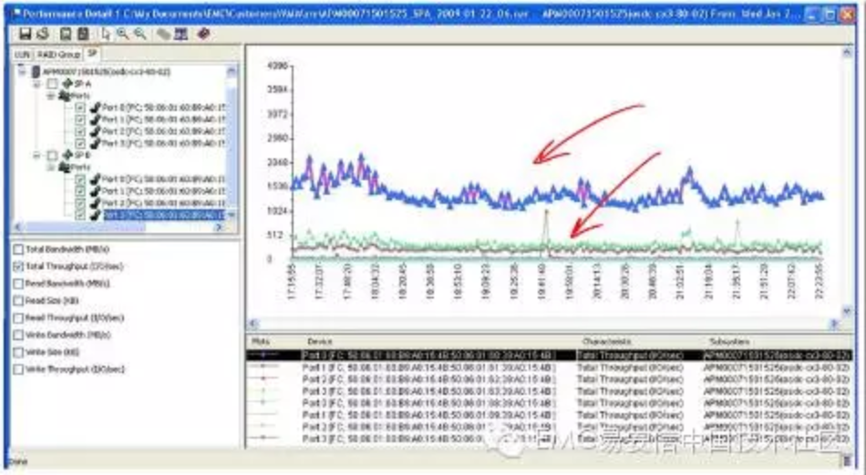

# SAN网络性能问题排错指南

主机和FC阵列间出现了性能问题，应该如何排错？快来看看下面的建议，也许可以让你少走不少弯路。

## 1. 由于性能问题通常难以定位（特别当工程师在以远程的方式提供服务），事先收集足够详细和明确的信息可以节省后续大量的时间和精力

​    o    问题的详细描述

​    o    问题第一次出现是什么时候？是怎么发现的？

​    o    问题再次出现是什么时候？

​    o    问题最严重的时刻是何时？

​    o    出现了哪些症状？

​    o    主机上出现了哪些错误？

​    o    哪些设备（主机的LUN，大型机的UCB）受到影响？

## 2. 你是如何测量性能问题的？

​    o    曲线图

​    o    图表

​    o    使用的工具和监控协议（如SNMP）采样时间间隔

## 3. 最近针对SAN网络有什么变动？提供这些变动的细节

​    o    SAN网络中增加或移除的设备，包括主机、存储阵列、远程复制设备和交换机

​    o    存放或备份的数据量的变化

​    o    整个网络带宽（SAN、LAN或WAN）的变化

​    o    任何其他会影响到性能的变化

## 4. 物理层是否已经都检查过了？

​    o    参考以下步骤排错光纤交换机端口通讯问题

​           i.    确认涉及通讯故障的节点和交换机端口

​           ii.    确认交换机端口状态是” Administratively Up”

​           iii.    将SFP模块连同光纤线缆换到同一台交换机的其它插槽

​           iv.    如果问题依旧，则交换机有问题。如果问题解决了，则可能是SFP模块、光纤线或节点HBA有问题

​           v.    如果SFP模块、光纤线的问题都排除了，则继续检查主机端的HBA

​    o    如果需要，EMC工程师会帮忙开单并派遣现场工程师上门检查物理层设备

​    o    确认所有链路连通性节点（主机到交换机、远端阵列到交换机、光纤跳线板等）已尝试过物理复位（重插拔）

## 5. 提供出现性能问题的数据路径上端到端的设备信息

​    o    是否有同一数据链路上的其他设备也遇到了性能问题？

​    o    后端设备的型号是？

​    o    主机类型和版本是？

​    o    HBA类型和版本是？

​    o    主机上安装的EMC软件和版本（比如PowerPath）

​    o    哪些应用受影响？

​    o    提供HBA的pWWN和目标阵列（FA/SP等）的pWWN

​    o    提供交换机物理接口信息

​    o    提供主机initiator连入的交换机日志

​    o    提供目标阵列连入的交换机日志

​    o    提供光纤网络逻辑图（Visio、网络管理软件、网络快照等）

EMC Connectivity售后团队会尽最大努力帮助客户分析并纠正性能问题。但售后团队主要的工作内容是故障修复（break/fix），如果这一问题最终被确认为不是因为故障而引起的性能问题，那我们会将问题移交给EMC Professional Service部门的性能分析团队来处理。如果您确实需要这一服务的话，EMC售后团队会帮您联络必要的资源。