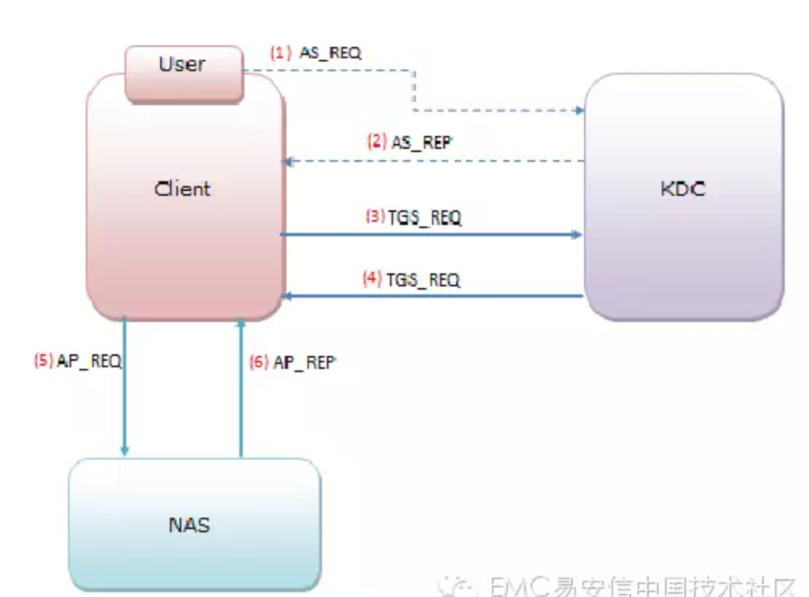

# CIFS安全协议之Kerberos

大家都知道对于NAS的CIFS 来说，NTLM和Kerberos是两个比较重要的验证方式。今天我们来讨论一下作为CIFS安全认证之一的Kerberos协议。

Kerberos 是一种依赖于验证技术共享密钥的协议，其基本概念很简单，如果一个秘密只有两个人知道，任何一个人都可以通过他们之间共享的秘密来确定对方的身份。用技术的语言来讲，就是对称加密，互相确认。

说到这里，可能有人会问，NTLM也是CIFS的安全认证啊，为什么Kerberos会用的更广泛呢？他的优点又在哪呢？相信大家了解了Kerberos的工作原理之后就会清楚了。

Kerberos认证和我们看电影的过程差不多，主要分三个步骤：

第一步咨询：用户登陆domain

第二步买票：用户获得service票据

第三步来访：使用服务票据访问某服务

## 用户登陆domain (Logging into the Domain)

1. Authentication Server request

AS_REQ，即上图步骤(1)

一个用户在一台Client机上第一次登陆时，会有弾框提示输入用户名和密码。这时用户密码信息会通过Hash算法产生一个用户的Long Term Key(LTK)，再和用户登陆Client端时的时间戳一起进行加密，然后这个用户验证请求被发送给Kerberos Data Center(KDC)，并要求KDC返回一个相应的Ticket Granting
Ticket(TGT)。

2. Authentication Server response

AS_REP，即上图步骤(2)

KDC在数据库中先找到该用户的密码，并用同样的Hash算法生成一个LTK。 然后KDC通过LTK从预认证信息Preauth包KRB_AR_REQ中解密出用户信息和时间戳， 如果用户信息无误，并且时间戳和目前信息相差在5分钟之内，KDC会认为该用户验证通过。KDC将生成一个TGT，并准备把TGT返回给Client。

在生成TGT的同时，KDC生成一组随机数作为Logon Session Key，并让他和客户端传来的LTK再次进行加密，产生一个名叫enc-part的信息放在该KRB_AS_REP包中，KDC还会用生成的TGT与能被所有KDC识别的LTK进行加密，再次产生一个enc-part放在TGT的头中，这样就得到了一个只有KDC能解开的TGT，最后把这个TGT加入KRB_AS_REP包中并发送至Client端。

3. Ticket cache

Client端收到KRB_AS_REP后会用自己的LTK来解密KRB_AS_REP中的enc-part，这里我们默认会得到KDC选用的随机数Logon Session Key。这时候Client端将会把得到的Logon Session Key和KRB_AS_REP中带有原始时间戳的TGT一起存入票据内存中准备给下面过程使用。

PS：这时候KDC为了减少自身负担，并没有吧Logon Session Key保存在自己这边，所有只有这个用户在Client端的票据内存里面才有该记录了。

## 用户获得service票据(Getting a Service Ticket)

1. Ticket Granting Server request

TGS_REQ，即上图步骤(3)

Client端接下来会拿着TGT去告诉KDC我要访问某服务，并让KDC给他访问该服务的票据(service ticket)，以后他就可以拿着这张票据直接访问该服务了. Client端用现在的时间戳和之前存在票据内存中的Logon Session Key进行加密生成Authenticator，然后再把带有原始时间戳的TGT一起打包发送给KDC等待验证。

2. Ticket Granting Server response

TGS_REP，即上图步骤(4)

KDC收到KRB_TGS_REQ后会用自己的LTK解密出TGT，然后看看TGT中的原始时间戳，如果来确定TGT现在还是处于有效的状态，KDC就会从TGT中读取Logon Session Key，并用这个Logon Session Key解密Authenticator来获得第二次记录的时间戳，如果该时间差在5分钟之内，KDC认为验证成功，并将生成一个service ticket。

PS：Kerberos为了防止重演攻击，特别加入了对时间戳的验证。

接下来KDC又会生成一组叫做Service Session Key的随机数，并把这组随机数和service ticket中记录的Logon Session Key进行加密，产生一个名叫enc-part的信息放在该KRB_TGS_REP包中，KDC还会用生成的service ticket与能被所有KDC识别的LTK进行加密，再次产生一个enc-part放在TGS的头中，这样就得到了一个只有KDC能解开的service ticket，最后把这个service ticket加入KRB_AS_REP包中并发送至Client端。

3. Ticket Cache

Client收到KRB_TGS_REP后，通过票据内存中的Logon Session Key解密enc-part，然后得到KDC生成的Service Session Key。最后把Service Session Key和service ticket一起作为访问目标服务器的Credential存入票据内存中。

## 使用服务票据访问某服务(Using the Service Ticket)

1. Application Server request

AP_REQ，即上图步骤(5)

经过上面的两次验证，Client现在就能拿着服务票据去访问该服务了。Client记录下时间戳，并读取内存中的Service Session Key与他进行加密生成新的Authenticator，同时用户还要标记好自己是否需要双向认证 (Mutual
Authentication)，最后再加上之前的服务票据一起发送给该服务的server(在NAS系统中相对应的服务就是CIFS，server就是我们加入domain的CIFS server)。

2. Application Server response

AP_REP，即上图步骤(6)

NAS收到这个加密的KBR_AP_REQ之后，用自己的LTK进行解密。接着server从service ticket里面读出service session Key来解密Authenticator中的时间戳。如果时间差小于5分钟，NAS就允许该用户对他进行访问了，并且为这个Client上的这个用户创建一个security token。

Kerberos优点：

虽然上面Kerberos的工作原理稍微有点复杂，不过我们还是能从中看出Kerberos的高效性，相互身份验证以及互操作性的优点。

1. 高效性：客户端不用每次访问NAS时都去DC验证，而通过查询client credentials就可以验证了。
2. 相互身份验证：client和server可以互相验证。
3. 互操作性：微软的Kerberos V5实现是基于IETF的推荐标准规范。这样，Windows Server 2003的Kerberos V5实现就为其他使用Kerberos V5协议的网络的互操作打下了基。

