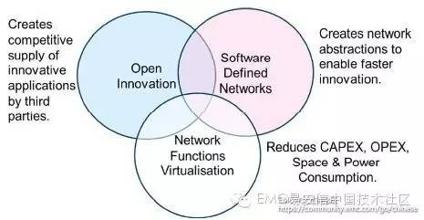
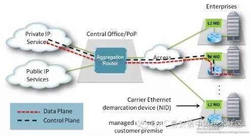
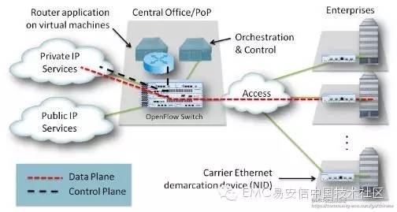

## 浅谈SDN和NFV的区别

EMC之前宣布成立新的NFV Group（Network Functions Virtualization Technology Group），并由联邦的核心智库CTO Office来直辖，EMC CTO Office的负责人John Roese在EMC PULSE博客中表示，EMC成立新的NFV Group，该部门成立的用意很明确，帮助运营商转型，助力它们迎接更为广阔的市场机遇。

那到底什么是NFV（网络功能虚拟化），它和之前的SDN（Software-defined Networking）软件定义网络概念是一回事吗？它们有什么区别？本文就带大家来一探究竟。

## SDN-诞生于校园，成熟于数据中心

SDN初始于园区网络，一群研究者（斯坦福的达人们）在进行科研时发现，每次进行新的协议部署尝试时，都需要改变网络设备的软件，这让他们非常郁闷，于是乎，他们开始考虑让这些网络硬件设备可编程化，并且可以被集中的一个盒子所管理和控制，就这样，诞生了当今SDN的基本定义和元素

- 分离控制和转发的功能
- 控制集中化（或集中化的控制平面）
- 使用广泛定义的（软件）接口使得网络可以执行程序化行为

另一个SDN成功的环境就是云数据中心了，这些数据中心的范围和规模的扩展，如何控制虚拟机的爆炸式增长，如何用更好的方式连接和控制这些虚拟机，成为数据中心明确需求。而SDN的思想，恰恰提供了一个希望：数据中心可以如何更可控。

## OpenFlow–驱动向前的标准

那么，OpenFlow是从何处走进SDN的视野中呢？当SDN初创伊始，如果需要获得更多的认可，就意味着标准化这类工作必不可少。于是，各路公司联合起来组建了开放网络论坛（ONF），其目的就是要将控制器和网络设备（也就是SDN提到的控制平面和转发平面）之间的通讯协议标准化，这就是OpenFlow。OpenFlow第一定义了流量数据如何组织成流的形式，第二定义了这些流如何按需控制。这是让业界认识到SDN益处的关键一步。

## NFV-由运营商提出

和SDN始于研究者和数据中心不同，NFV则是由运营商的联盟提出，原始的NFV白皮书描述了他们遇到的问题，以及初步的解决方案。

运营商网络的设备呈指数级的增长，越来越多各种类型的硬件设备不断的增加。当开展一个新的网络业务时，往往提出多样化的需求，寻找适合空间和电力去容纳这些“盒子”变得越来越困难。能耗的增加，资本投资的挑战，以及设计，集成和运行这些日益复杂的基于硬件的平台所需要的技术这些种种挑战复合在一起。另外，基于硬件平台的很快就有可能到达其生命周期，需要重复大量的采购–设计–集成–部署周期，也只能获取少量利润收益，甚至可能没有收益。

网络功能虚拟化的目标是使用标准的IT虚拟化技术，把现在大量的位于数据中心，网络节点以及最终用户处的这些不同类型网络设备–标准的服务器，交换机和存储设备集合在一起。我们相信网络功能虚拟化可以适用于任何数据平面的包处理，控制平面的功能集成，以及无线网络的基础架构中。

## SDN vs NFV

现在，让我们看看SDN和NFV的关系，原始的NFV白皮书给出一个SDN和NFV关系的概述

如图所示，网络功能虚拟化和软件定义网络有很强的互补性，但是并不相互依赖（反之亦然），网络功能虚拟化可以不依赖于SDN部署，尽管两个概念和解决方案可以融合，并且潜在形成更大的价值。

依赖于应用在大量数据中心内的现有技术，网络功能虚拟化的目标可以基于非SDN的机制而实现。但是，如果可以逐渐接近SDN所提出的将控制平面和数据平面的思路，那么就能进一步使现有的部署性能增强且简化互操作性，减轻运营和维护流程的负担。网络功能虚拟化为SDN软件的运行提供基础架构的支持，未来，网络功能虚拟化可以和SDN的目标紧密联系在一起—-使用通用的商业性服务器和交换机。

## SDN和NFV协同工作？

让我们看一个SDN和NFV协同工作的案例，首先，下图展示了当今路由器服务部署典型案例，在每个客户站点使用均使用一台路由器提供服务：

如下图所示，使用虚拟路由器的功能，NFV就可以在这个场景中展现作用，所有的用户站点左侧都是一个网络接口设备（NID）–虚拟路由器，提供网络的分界点，并且测量性能：

最终，SDN被引入进来，将控制平面和转发平面分割，数据包将会根据更优化的数据平面被转发，路由（控制平面）功能则运行在某机柜服务器的虚拟机内。

SDN和NFV的结合提供了最优的解决方案

- 一个昂贵的专业设备被通用硬件和高级软件替代
- 软件控制平面被转移到了更优化的位置（从专用设备硬件中剥离，放置在数据中心或者POP位置，可能以服务器或者虚拟机的形式存在）
- 数据平面的控制被从专有设备上提取出来，并且标准化，使得网络和应用的革新无需网络设备硬件升级

## 汇总

下表列举了SDN和NFV的一些关键点比较

| 分类    | SDN                           | NFV                        |
| ----- | ----------------------------- | -------------------------- |
| 产生原因  | 分离控制和数据平面中央控制可编程网络            | 从专有硬件到普遍硬件过渡重新定位网络功能       |
| 目标位置  | 校园网络，数据中心/云                   | 运营商网络                      |
| 目标设备  | 商用服务器和交换机                     | 商用服务器和交换机                  |
| 初始化应用 | 基于云协调器和网络                     | 路由器，防火墙，网关，CDN，广域网加速，SLA保证 |
| 新的协议  | OpenFlow                      | 尚无                         |
| 组织者   | Open Networking   Forum (ONF) | ETSI NFV Working   Group   |

 