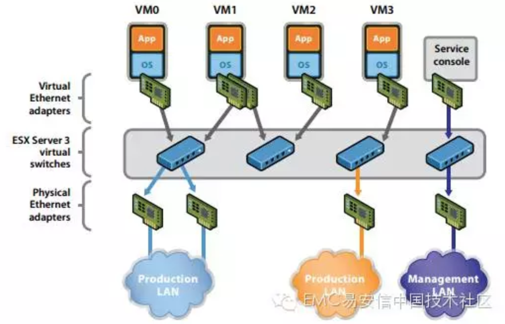

# 网络虚拟化（二）：虚拟交换机

虚拟交换机作为虚拟网络连接的关键组件，可以让ESXi主机上的虚拟机在使用相同协议的情况下实现通信，并连接到外部网络。本文将介绍VMware虚拟交换机技术。

虚拟交换机在许多方面都与物理以太网交换机相似。每个虚拟交换机都是互相隔离的，拥有自己的转发表，因此交换机查找的每个目的地只能与发出帧的同一虚拟交换机上的端口匹配。它可以在数据链路层转发数据帧，然后通过以太网适配器出口连接到外部网络。虚拟交换机能够将多个以太网适配器绑定在一起，类似于传统服务器上的网卡绑定，从而为使用虚拟交换机提供更高的可用性和带宽。它还支持端口级别的VLAN分段，因此可以将每个端口配置为访问端口或中继端口，从而提供对单个或多个VLAN的访问。

但是与物理交换机不同，虚拟交换机不需要生成树协议，因为它强制使用单层网络连接拓扑。多个虚拟交换机无法进行互连，在同一台主机内，网络通信流量无法在虚拟交换机之间直连流动。虚拟交换机通过一个交换机提供用户需要的所有端口。虚拟交换机无需进行串联，因为它们不共享物理以太网适配器。

## 虚拟交换机可提供二种与主机和虚拟机相连接的类型：

- 将虚拟机连接到物理网络。
- 将VMkernel服务连接到物理网络。VMkernel服务包括访问IP存储（如：NFS或iSCSI）、执行vMotion迁移以及访问管理网络。

设计网络连接环境时，您可以通过VMware vSphere将所有网络都置于一个虚拟交换机中。或者，您也可以选择多个虚拟交换机，每个虚拟交换机具有一个单独的网络。具体作何选择在某种程度上取决于物理网络的布局。例如：您可能没有足够的网络适配器，无法为每个网络创建一个单独的虚拟交换机。因此，您可能会将这些网络适配器绑定在一个虚拟交换机上，然后使用VLAN来隔离这些网络。

## 虚拟网络支持二种类型的虚拟交换机：

- 虚拟网络标准交换机：主机级别的虚拟交换机配置。

标准交换机可以将多个虚拟机连接起来，并使它们彼此可以进行通信。每个标准交换机最多有4088个虚拟交换机端口，而每台主机最多有4096个虚拟交换机端口。下图显示了几个标准交换机的不同用途。这些交换机从左到右依次为：

1. 配置绑定网卡的标准交换机。绑定的网卡可自动分发数据包以及执行故障切换。
2. 仅限内部使用的标准交换机，允许单个ESXi主机内的虚拟机直接与其他连接到同一标准交换机的虚拟机进行通信。VM1和VM2可使用此交换机互相通信。
3. 配置一个出站适配器的标准交换机。该交换机提供VM3使用。
4. VMkernel用来实现远程管理功能的标准交换机。

- 虚拟网络分布式交换机：虚拟网络分布式交换机是一款数据中心级交换机。标准交换机基于主机工作，交换机配置保存在ESXi主机上面。而数据中心交换机能够独立于物理结构实现统一虚拟化管理。虚拟网络分布式交换机配置通过vCenterServer管理，并且所有虚拟网络配置的详细信息都存储在vCenter Server数据库中。VXLAN网络可在一个或多个vSphereDistributed Switch上进行配置。

另外，vNetwork分布式交换机具有以下特征：

1. 独立于物理结构的统一网络虚拟化管理。
2. 针对整个数据中心管理一台交换机与针对每台主机管理若干标准虚拟交换机。
3. 支持VMware vSpherevMotion，因此统计数据和策略可随虚拟机一同转移。
4. 独立的管理界面。
5. 高级流量管理功能。
6. 监控和故障排除功能，如NetFlow和端口镜像。
7. 主机级别的数据包捕获工具（tcpdump）。

