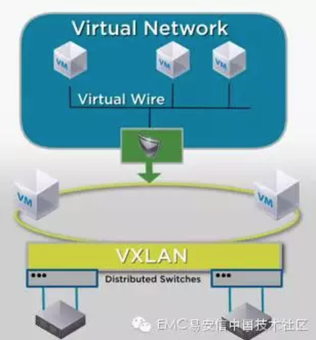
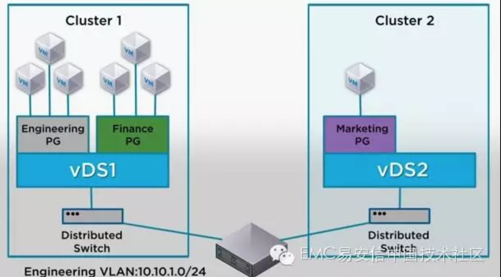
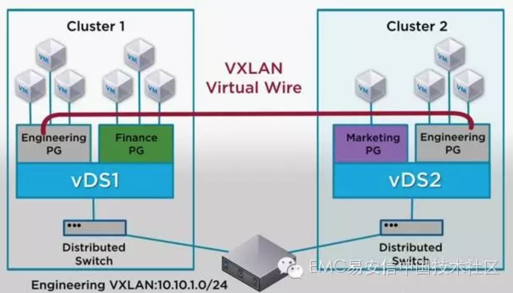

# 网络虚拟化（三）：VXLAN虚拟可扩展局域网（上）

在2011年的VMworld大会上，VMware提出了VXLAN（virtual Extensible LAN虚拟可扩展局域网）技术。VXLAN技术是VMware、CISCO、Arista、Broadcom、Citrix和Redhat等厂商共同开发用于虚拟网络的技术，与之抗衡的有Microsoft联合Intel、HP和Dell开发的NVGRE标准（Network Virtualization using Generic Routing Encapsulation）。本文将重点介绍VXLAN的优势、VMware的VXLAN组件和应用案例分析。

## VXLAN逻辑网络有以下几项优于传统物理网络的明显优势：

1. 突破了传统VLAN的数量限制。

物理网络使用VLAN来限制和隔离第2层广播域，VLAN的数量上限为4094个。随着主机虚拟化技术的兴起，4094个VLAN数已经远不能满足云数据中心的需求。不同于VLAN的4094限制，VXLAN网络可以支持多达1600万个VLAN标识符。

2. 突破了传统的物理界限，满足多租户环境和规模扩展的需求。

VXLAN网络是一个创建叠加在物理网络基础架构之上的逻辑网络，实现了在底层硬件上的独立配置。VXLAN网络大大减少了数据中心网络管理和配置所花费的时间，它提供的多层次网络拓扑结构和企业级安全服务，可将部署、调配时间从几周减少到数小时。同时，在VXLAN网络部署的虚拟机可以实现跨物理机迁移，例如：北京数据中心的虚拟机可以和上海的数据中心的虚拟机在二层网络上进行通信，同时支持跨数据中心物理机迁移功能，打破了传统的二层网络的界限。

3. 解决STP（生成树协议）高负荷。

VXLAN 中使用了新技术替代STP（生成树协议）, 因此解决了汇聚层交换机由于STP高负荷导致的压力过大问题。

## 在vSphere 5.5版本中，VXLAN实现组件包括：

- vShield Manager

vShield Manager是vShield的集中式网络管理组件，可作为虚拟设备安装在vCenter Server 环境中的任意ESX主机上。vShieldManager可在与安装vShield代理不同的ESX主机上运行。

使用 vShield Manager用户界面或vSphere Client插件，管理员可以安装、配置和维护vShield组件。vShield Manager可以定义并管理VXLAN网络，包括：定义VXLAN网络的延展范围、配置vSphere承载VXLAN网络的VDS和配置VTEP等。

- vSphere分布式交换机

在VXLAN网络中vSphere分布式交换机用于连接主机和互连。

- vSphere主机

在VXLAN网络中每台vSphere主机上需要配置虚拟安全加密链路端点（VETP）模块，每个主机VEP会分配到一个唯一的IP地址，在vmknic虚拟适配器上进行配置，用于建立主机之间的通信安全加密链路并承载VXLAN流量。VTEP由以下三个模块组成：

1. vmkernel模块

此模块负责VXLAN数据路径处理，其中包括转发表的维护以及数据包的封装和拆封。

2. vmknic虚拟适配器

此模块用于承载VXLAN控制流量，其中包括对多播接入、DHCP和ARP请求的响应。

3. VXLAN端口组

此端口组包括物理网卡、VLAN信息、绑定策略等。端口组参数规定了VXLAN流量如何通过物理网卡进出主机VTEP。

## 创建VXLAN虚拟网络案例演示

此方案的情形如下：在数据中心的两个群集上有多个 ESX 主机。工程部门和财务部门都在Cluster1 上。市场部门在Cluster2 上。两个群集都由单个vCenter Server 5.5进行 管理。

Cluster1 上的计算空间不足，而 Cluster2 未充分利用。老板要求IT管理员将工程部门的虚拟机扩展到 Cluster2上，实现工程部门的虚拟机位于两个群集中，并且能够彼此通信。如果 IT管理员使用传统方法解决此问题，他需要以特殊方式连接单独的 VLAN 以便使两个群集处于同一二层域中。这可能需要购买新的物理设备以分离流量，并可能导致诸如 VLAN 散乱、网络循环以及系统和管理开销等问题。

通过 VXLAN技术，IT管理员可以通过跨dvSwitch1 和 dvSwitch2 构建VXLAN 虚拟网络，在不添加物理设备的情况下达到要求。

