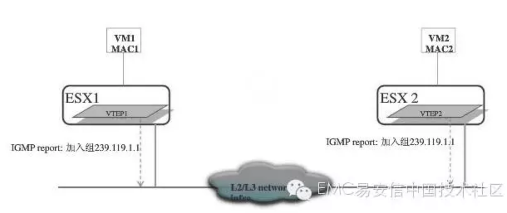
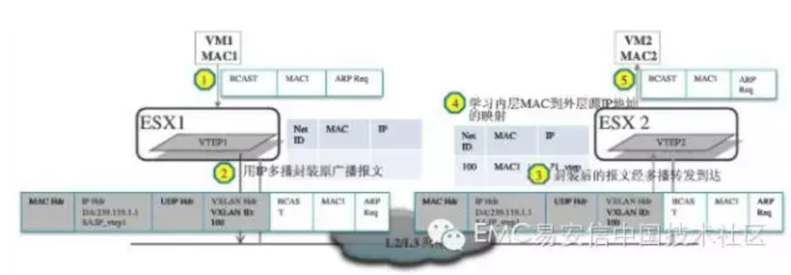
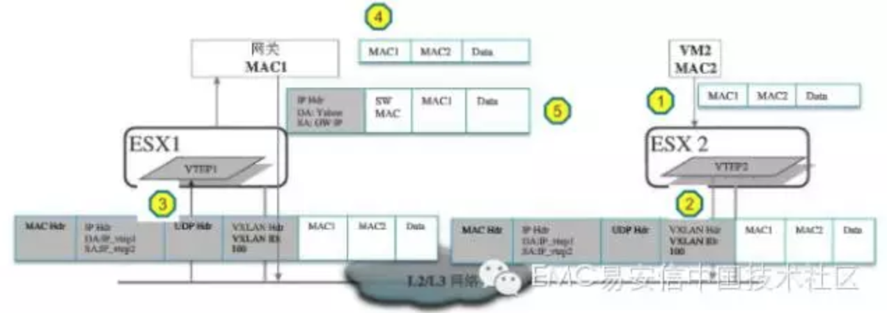
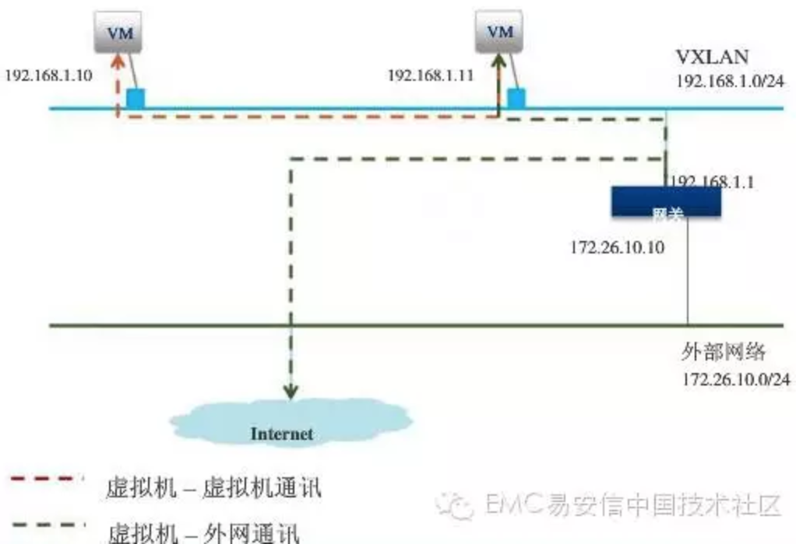
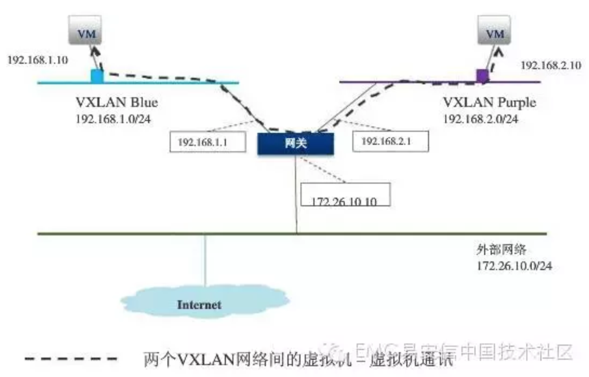

# 网络虚拟化（四）：VXLAN虚拟可扩展局域网（下）

上篇文章《VXLAN虚拟可扩展局域网（上）》中介绍了VXLAN的优势、VMware环境中VXLAN的组件和应用案例，本文将分析VXLAN传输数据包、工作原理和案例解析。

## VXLAN传输数据包

VXLAN虚拟可扩展局域网是一种overlay的网络技术，使用MAC in UDP的方法进行封装，在封装包中间添加了一层共50字节的VXLAN Header，然后以IP数据包的形式通过3层网络进行传输。位于VXLAN安全加密链路任何一端的虚拟机不知道这个封装包。同时，物理网络中的设备也不知道虚拟机的源或目的MAC或IP地址。VXLAN的封装结构如下图所示：

1. VXLAN Header：

共计8个字节，目前被使用的是Flags中的一个标识位和24bit的VXLAN Network Identifier，其余的部分没有定义，但是在使用的时候必须设置为0×0000。

2. 外层的UDP报头：

目的端口使用4789，但是可以根据需要进行修改。同时UDP的校验和必须设置成全0。

3. IP报文头：

目的IP地址可以是单播地址，也可以是多播地址。

单播情况下，目的IP地址是VXLAN Tunnel End Point(VTEP)的IP地址。

在多播情况下引入VXLAN管理层，利用VNI和IP多播组的映射来确定VTEPs。

从封装的结构上来看，VXLAN提供了将二层网络overlay在三层网络上的能力，VXLAN Header中的VNI有24个bit，数量远远大于4096，并且UDP的封装可以穿越三层网络，因此比的VLAN更好的可扩展性。

## VXLAN协议网络工作原理

1. 网络初始化

在VXLAN协议工作前需要进行网络初始化配置。网络初始化就是让虚拟网络中的主机加入到该VXLAN网络所关联的多播组。例如：VM1和VM2连接到VXLAN网络，那么二台VXLAN主机（ESXi1和ESXi2）就需要先加入IP多播组239.119.1.1。VXLAN的网络标识符（VNI）就是网络ID。

2. ARP查询

下图描述了VXLAN协议中二个连接到逻辑2层网络的虚拟机（VM1和VM2）ARP查询流程。

- VM1以广播形式发送ARP请求；
- VTEP1封装报文。本例中，VXLAN 100关联在IP多播组239.119.1.1中，VNI为100；
- VTEP1通过多播组将数据包发送给VTEP2；
- VTEP2接收到多播包。VTEP2将验证VXLAN网段ID，拆封数据包，然后将通过2层广播包的形式其转发到虚拟机VM2；
- VM2收到广播包后发送ARP响应。

注意：VTEP1只会在VTEP转发表中没有虚拟机MAC与该MAC地址的VTEP IP之间的映射时，才会生成多播包。在广播数据包时，如果MAC转发表中没有与帧目的MAC地址相匹配的条目，2层交换机会执行ARP查询操作。在发现虚拟机MAC地址与VTEP IP地址的映射条目并将其更新到转发表中后，任何与该特定虚拟机通信的请求都将通过点到点安全加密链路传输。

3. ARP应答

ARP应答处理流程类似于ARP请求，不同之处在于VM2将通过单播包进行ARP响应。因为VTEP2已经获得了VM1的MAC地址、IP地址以及VTEP1的信息。VTEP2将建立一个转发条目，以后交换数据包操作会使用该转发条目。

4. VXLAN网关

如果需要VXLAN网络和非VXLAN网络连接，必须使用VXLAN网关才能把VXLAN网络和外部网络进行连接。下图描述了VXLAN网关的工作原理：

- VM2通过网关MAC地址向网关发送数据包；
- VTEP2封装数据包，通过多播（第一次）发送给VTEP1;
- VTEP1拆封数据包，并发送到网关；
- 网关将IP数据包路由到Internet。

## 案例（一）

当二台虚拟机在同一逻辑2层网络中时，如果二个虚拟机都在同一台vSphere主机上，那么数据包无需封装。如果二个虚拟机在不同vSphere主机上，一台vSphere主机上的源VTEP将虚拟机数据包封装到一个新UDP标头中，并通过外部IP网络将其发送到另一台vSphere主机上的目标VTEP。

## 案例（二）

图中显示了二个虚拟网络VXLAN-A和VXLAN-B。二个网络分别属于192.168.1.0/24网段和192.168.2.0/24网段，二个网络通过VXLAN网关进行连接。以下是可能情况：

1. 当所有虚拟机和VXLAN网关位于同一vSphere主机上时。虚拟机将流量导向各自逻辑网络子网的网关IP地址，VXLAN会根据防火墙规则在二个不同接口之间进行路由。

2. 当所有虚拟机不在同一台vSphere主机上，而VXLAN网关部署在其中一台vSphere主机时。虚拟机的流量将被封装到数据包，然后进过物理网络传送到VXLAN网关，之后将由网关将数据包路由到正确的目标。

3. 当所有虚拟机和VXLAN网关不在同一台vSphere时。数据包传输将类似于情况2。

