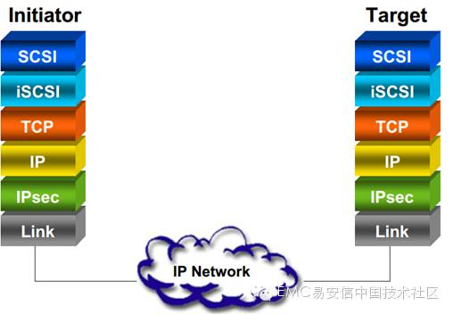
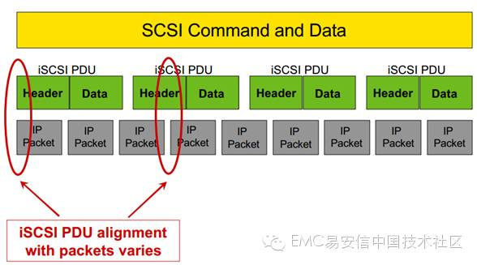
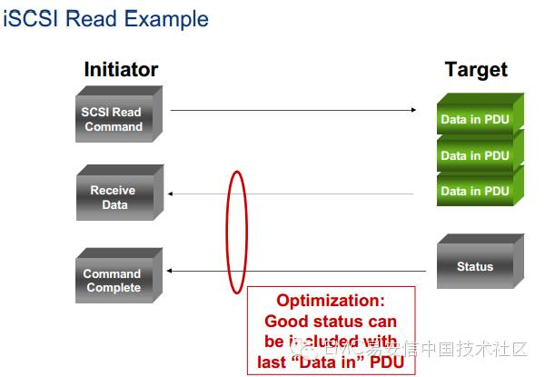
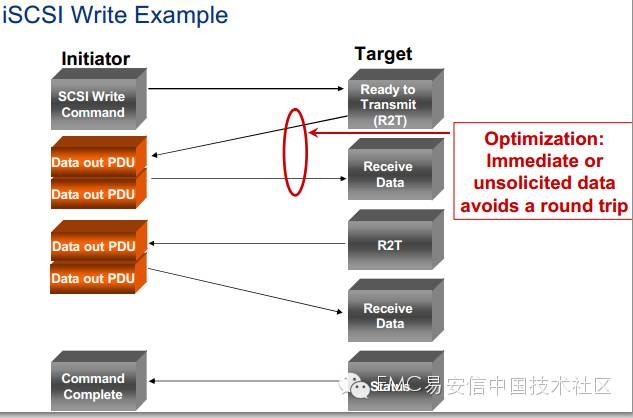
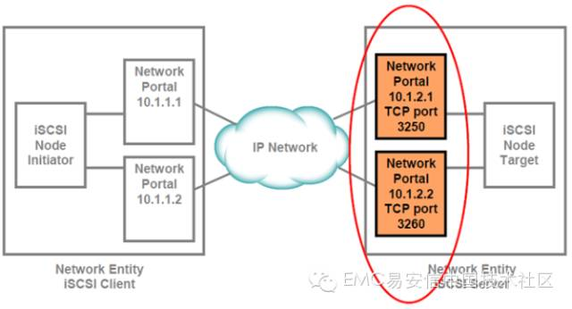

# iSCSI存储系统基础知识（三）

## 协议映射

iSCSI协议是让SCSI协议在TCP协议之上工作的传输协议，是一种SCSI远程过程调用模型到TCP协议的映射。SCSI命令加载在iSCSI请求之上，同时SCSI状态和响应也由iSCSI来承载。iSCSI同样使用请求响应机制。在iSCSI 配置中，iSCSI 主机或服务器将请求发送到节点。 主机包含一个或多个连接到IP 网络的启动器，以发出请求，并接收来自iSCSI 目标的响应。 为每个启动器和目标都指定了一个唯一的iSCSI 名称，如 iSCSI 限定名 (IQN) 或扩展的唯一标识(EUI)。 IQN 是 223 字节的ASCII 名称。EUI 是 64 位标识。iSCSI 名称代表全球唯一命名方案，该方案用于标识各启动器或目标，其方式与使用全球节点名(WWNN) 来标识光纤通道光纤网中设备的方式相同。

iSCSI 目标是响应 iSCSI 命令的设备。iSCSI 设备可以是诸如存储设备的结束节点，或者可以是诸如IP 与光纤通道设备之间的网桥的中间设备。每个iSCSI 目标由唯一的iSCSI 名称标识。

要通过 IP 网络传输 SCSI 命令，iSCSI 驱动程序必须安装到iSCSI 主机和目标中。驱动程序用于通过主机或目标硬件中的网络接口控制器(NIC) 或 iSCSI HBA 来发送iSCSI 命令和响应。

为实现最佳性能，请使用传输速度为每秒 1000 兆位 (Mbps) 的千兆以太网适配器在iSCSI 主机和 iSCSI 目标间进行连接。

## iSCSI 命令封装

发起端和目标端之间以消息的形式进行通信。PDU（Protocal Data Unit）就是用来传输这些消息的。

iSCSI 协议就是一个在网络上封包和解包的过程，在网络的一端，数据包被封装成包括TCP/IP头、iSCSI识别包和SCSI数据三部分内容，传输到网络另一端时，这三部分内容分别被顺序地解开。iSCSI 系统由一块 SCSI 卡发出一个 SCSI 命令，命令被封装到第四层的信息包中并发送。

接收方从信息包中抽取SCSI 命令并执行，然后把返回的SCSI命令和数据封装到IP信息包中，并将它们发回到发送方。系统抽取数据或命令，并把它们传回SCSI子系统。所有这一切的完成都无需用户干预，而且对终端用户是完全透明的。 为了保证安全，iSCSI 有自己的上网登录操作顺序。在它们首次运行的时候，启动器(initiator)设备将登录到目标设备中。

任何一个接收到没有执行登录过程的启动器的iSCSI PDU目标设备都将生成一个协议错误，而且目标设备也会关闭连接。在关闭会话之前，目标设备可能发送回一个被驳回的iSCSI PDU。这种安全性是基本的，因为它只保护了通信的启动，却没有在每个信息包的基础上提供安全性。还有其他的安全方法，包括利用IPsec。在控制和数据两种信息包中，IPsec 可以提供整体性，实施再次(replay)保护和确认证明，它也为各个信息包提供加密。

## iSCSI 会话

iSCSI 会话建立于一个initiator与一个target之间，一个会话允许多个TCP连接，并且支持跨连接的错误恢复。大多数通信还是建立在SCSI基础之上的，例如，使用R2T进行流量控制。iSCSI添加于SCSI之上的有：立即和主动的数据传输以避免往返通信；连接建立阶段添加登录环节，这是基于文本的参数协商。建立一个iSCSI会话，包括命名阶段：确定需要访问的存储，以及initiator，与FC不同，命名与位置无关；发现阶段：找到需要访问的存储；登录阶段：建立于存储的连接，读写之前首先进行参数协商，按照TCP连接登录。

## 结构模式

iSCSI有两大主要网络组件。第一个是网络团体，网络团体表现为可通过IP网络访问的一个驱动或者网关。一个网络团体必须有一个或者多个网络入口，每一个都可以使用，通过IP网络访问到一些iSCSI节点包含在网络团体中。第二个是网络入口，网络入口是一个网络团队的组件，有一个TCP/IP的网络地址可以使用给一个iSCSI节点，在一个ISCSI会话中提供连接。一个网络入口在启动设备中间被识别为一个IP地址。一个网络入口在目标设备被识别为一个IP地址+监听端口。

## iSCSI端口组

iSCSI支持同一会话中的多个连接。在一些实现中也可以做到同一会话中跨网络端口组合连接。端口组定义了一个iSCSI节点内的一系列网络端口，提供跨越端口的会话连接支持。