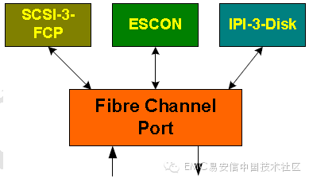
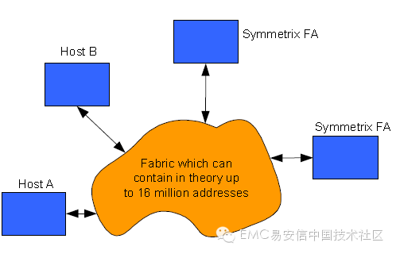

## Fibre Channel光纤通道系统基础（一）

光纤通道技术（Fibre Channel）是一种网络存储交换技术，可提供远距离和高带宽，能够在存储器、服务器和客户机节点间实现大型数据文件的传输。了解光纤通道技术是了解网络存储的起点。本系列文章全面介绍光纤通道系统的基础知识。内容包括Fibre Channel基本概念和优势，术语解释，拓扑结构。作为存储爱好者的入门读物。

## Fibre Channel的概念

Fibre Channel (FC) 是一种高速网络互联技术（通常的运行速率有2Gbps、4Gbps、8Gbps和16Gbps），主要用于连接[计算机]()存储设备。过去，光纤通道大多用于[超级计算机]()，但它也成为企业级存储[SAN]()中的一种常见连接类型。尽管被称为光纤通道，但其信号也能在[光纤]()之外的[双绞线]()上运行。

光纤通道协议（Fibre Channel Protocol，FCP）是一种类似于[TCP]()的传输协议，大多用于在光纤通道上传输[SCSI]()命令。

光纤通道广泛用于通信接口，并成为传统I/O接口与网络技术相结合趋势的一部分。Network运作于一个开放的，非结构化的并且本质上不可预测的环境。Channels通常运行在一个封闭的、结构化的和可预测的环境，该环境下所有与主机通信的设备都预先已知，任何变更都需要主机软件或配置表进行相应更改。通道协议如SCSI，ESCON, IPI。Fibre Channel将这两种通信方式的优势集合为一种新的接口，同时满足network和channel用户的需求。

## Fibre Channel的目标与优势

Fibre Channel要提供的是一个连接计算机和共享外围设备的接口，在这一技术提出之前是通过多种不同的接口来连接的，如IDE，SCSI，ESCON。

Fibre Channel需要提供大量信息的高速传输。

上图显示了2Gbps Fibre Channel与Escon和SCSI同等级下的传送速率对比。

除了速度增长以外，Fibre Channel也需要支持公里级的距离。通过光纤交换机实现，如下图所示：

光纤通道还需要提供传输多种上层协议的能力，并维持这些上层协议的持续使用。光纤通道接口如下图所示：

连接和扩展是光纤通道的一个主要目标，通过将数千个设备共享数据并连接在一起来实现。Fibre Channel支持交换光纤，一个光纤结构理论上可支持一千六百万地址。光纤结构可以从一个单一交换机开始，按照需求可添加更多交换机来实现扩展。

光纤通道还需要提供比例如SCSI形式更简单的线缆和插头。光纤线缆比传统SCSI铜线更易于管理，插头体积更小从而一个适配器端口密度更高。当使用光纤线缆时，系统安装更为简便。下图显示了Fibre Channel使用的LC插头。

无中断安装和服务也是光纤线缆的一个要求。不同于铜线，在插拔时需要断电，光纤在上下电时无需担心瞬态损伤。

可靠性，可用性和可维护性一直是光纤通道协议的目标。与铜线相比它具有明显的优势：对电磁干扰和线间串扰不明显。