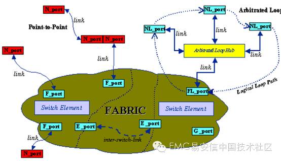
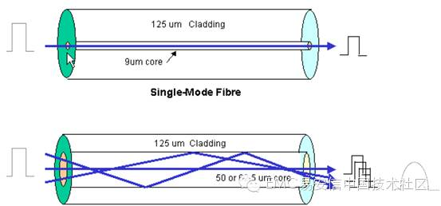

## Fibre Channel光纤通道系统基础（二）

光纤通道技术（Fibre Channel）是一种网络存储交换技术，可提供远距离和高带宽，能够在存储器、服务器和客户机节点间实现大型数据文件的传输。了解光纤通道技术是了解网络存储的起点。本系列文章全面介绍光纤通道系统的基础知识。内容包括Fibre Channel基本概念和优势，术语解释，拓扑结构。作为存储爱好者的入门读物。

本文作为系列之二，介绍光纤通道技术中的关键术语如：节点，端口，光纤，单模和多模，网络，拓扑。

## 节点（Node）

光纤通道环境包括两个或更多通过互联拓扑连接在一起的设备。光纤通道设备如个人电脑，工作站，磁盘阵列控制器，磁盘和磁带设备都被称为节点。每个节点都是一个或多个节点的信息源或目的。以EMC为例节点可以是Symmetrix系统。每个节点需要一个或多个端口作为节点间通信的物理接口。端口是一个允许节点通过物理接口发送或接收信息的硬件附件。一些设备将这些端口集成，其他一些设备则使用可插拔端口如HBA。以EMC为例端口可以是Symmetrix FA适配器上的接口。

## 端口（Ports）

每一个光纤通道节点包含至少一个硬件端口，将该节点与光纤通道环境连接，并处理与其他端口的信息。此端口称为节点端口。一个节点可以有一个或多个节点端口。按照端口支持的协议标准有以下几种不同类型的节点端口：

N_PORT：Node_ports既可以用在端到端也可以用在光纤交换环境。在端到端环境下N_ports发送端与接收端之间直接互连。举例来说，一个HBA或一个Symmetrix FA端口就是一个N_port。

F_PORT：Fabric_Ports用于光纤交换环境下N_port之间的互连，从而所有节点都可以相互通信。通常这些端口在交换机上，允许HBA和其他设备如Symmetrix FA连接到光纤。

NL_PORT：NL_Port是支持仲裁环路的节点端口。例如，NL_Port可以是HBA或Symmetrix FA端口。

FL_PORT：FL_PORT是支持仲裁环路的交换端口。通常是交换机上连接到仲裁环路的端口。

E_PORT：E_Port是一个光纤扩展端口，用于在多路交换光纤环境下。E_ports通常指一个交换机上连接到光纤网络另一个交换机的端口。

G_PORT：G_Port是一个既能配成E_Port又能配成F_Port的通用端口。是一种位于交换机上的端口。

## 光纤（Fiber）

端口通过链路连接至光纤网络。此链路包括线缆和承载两个独立光纤网络间收发信息端口的其他连接器。链路可能包括光导纤维或电缆。发送信号可能是长波光，短波光，LED或电子信号。

光纤结构包括光传输的纤芯。纤芯包裹着覆层，功能是反射并控制光在芯内传输。纤芯和覆层由玻璃材质制造并且很容易被损坏。为了保护光纤避免受到物理损坏覆盖了更多保护层，以使光纤能够承受一定力度。并有一个光纤可弯曲的最小角度，在这个角度附近光纤将被弯曲，超过这个角度将会导致光纤传输信号衰减，最坏情况将导致光纤损坏。正常使用下线缆较为坚实并且除了要留意最小弯曲半径以外无需特别维护。芯径和外径（µm为单位）通常是光纤规格的定义方式。例如，62.5/125µm光纤，芯径为62.5µm外径为125µm。两根这样的光纤结合在一根双芯线缆中，两端有相应的双芯连接器。两根光纤以相反的方向发送和接收数据。双芯线缆允许同步发送和接收。

## 单模和多模（Single Mode and Multimode）

光纤通道中有两种传输模式。

单模链路的芯径为9-10µm并且使用位于光谱红外部分约为1300纳米的长波光作为光源。此光对于人眼是不可见的。下芯径允许单模链路支持端口间最大10km的距离，所有光在光纤中沿着同一路径传输，如下图所示。单模链路主要用于长距离传输，应用于Symmetrix Fibre Channel适配器的几个版本。

多模链路相对于单模成本较低，用于无需单模那样远距离传输的场景。光纤通道链路通常基于50或62.5µm芯径并支持光波长约为800nm。这种相对于单模增加的芯径意味着光在光纤中有多种传播路径。

这就导致一种情况：某些频率的光在光纤中沿着一条路径传输而其他光沿着另一条路径，这种结果称为模态色散（Modal Dispersion）。这导致光呈放射状从而限制了多模线缆的距离。

## 网络（Fabric）

术语Fabric用于光纤通道描述通用的交换或路由结构，该结构依据帧头的目的地址来传递帧。网络可能是端到端，交换光纤或是仲裁环路。

## 拓扑（Topology）

光纤通道拓扑描述端口之间的物理互连。光纤通道支持三种不同的互连方案，称为拓扑结构。分别是点对点，仲裁环和交换结构。