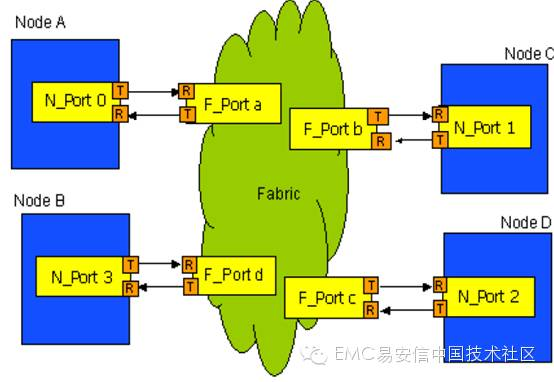
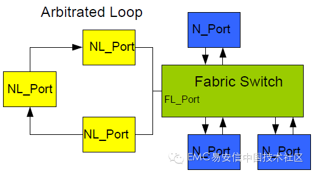

## Fibre Channel光纤通道系统基础（三）

光纤通道技术（Fibre Channel）是一种网络存储交换技术，可提供远距离和高带宽，能够在存储器、服务器和客户机节点间实现大型数据文件的传输。了解光纤通道技术是了解网络存储的起点。本系列文章全面介绍光纤通道系统的基础知识。内容包括Fibre Channel基本概念和优势，术语解释，拓扑结构。作为存储爱好者的入门读物。

本文作为系列之三，介绍光纤通道技术中的拓扑结构：端到端，光纤交换，仲裁环路，混合四种结构。

光纤通道提供了三种不同的拓扑结构和一个混合的互连拓扑结构。这些拓扑结构是：

- 端到端
- 光纤交换
- 仲裁环路
- 混合

## 端到端

端到端拓扑是所有拓扑结构中最简单的一种，允许两个N_Port通过链路直接互连。各N_Port的发送端直接连至另一端口的接收端。此链路为这两个端口专用，访问链路无需特定协议，因此这两个端口完全占据链路带宽。

## 光纤交换

端到端拓扑虽然很简单直观，但连接数量有限。这就导致了光纤交换技术的诞生，理论上支持一千六百万个端口（2^24）。交换网络可以包含单个交换机，或多个交换机互连作为一个逻辑整体。

每个N_Port通过相关链路连接至光纤网络端口（F_Port）。在光纤网络内各F_Port通过路由功能连接。这就使帧结构按照帧头的目标地址从一个F_Port路由至另一个F_Port。

多个并发连接可以同时在N_Port之间共存，因此，随着N_Port数量的增加，聚合带宽也在增长。

## 仲裁环路

仲裁环路比端到端提供更多连接，可在一个回路上支持126个NL_Port和1个FL_Port，在端到端和光纤交换之间提供一个中间值。在仲裁环路中一个端口的发送输出连接至下一个端口的接收端，所有节点之间都有这样的连接直到形成一个闭合环路。如下图所示。这类配置通常使用光纤通道集线器从而无需使用线缆。仲裁环路中各端口在环路上发现所有消息并忽视/传递目的地非本端口的信息。

## 混合光纤

光纤通道通过连接一个活多个仲裁环路到网络从而支持混合拓扑。这种方式结合了两种拓扑的长处。光纤网络拓扑提供连接选择和高聚合带宽，而仲裁环路拓扑提供低成本连接和共享带宽，而无需增加光纤交换机成本。

混合配置的好处在于仲裁环路上的NL_Port可通过交换机上的FL_Port连接光纤交换机上的N_Port，但需要进行必要的转换。这种转换包括将光纤网络地址转换成环路地址，以及将环路地址转换成光纤交换地址。该配置同时允许N_Port连接至仲裁环路上的NL_Port。÷