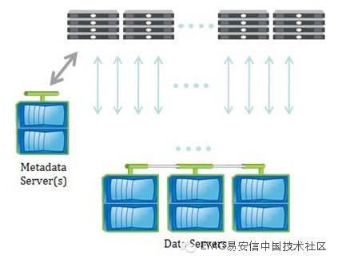

# NFSv4新特性介绍

NFS是*nix平台的文件共享协议，Microsoft Windows Server 2012操作系统也已经NFSv4。主要版本有NFSv2和NFSv3。NFSv4是NFSv3的继承版本，主要针对WAN环境部署NFS做出改进并提出NFS分布式文件系统方案。本文档主要为大家介绍NFSv4的主要新特性，详细内容如下：

## 伪文件系统

NFSv4将所有共享使用一个虚拟文件系统展示给客户端。伪文件系统根目录（/）使用fsid=0标示，只有一个共享可以是fsid=0。客户端需要使用“nfs server ip:/”挂载伪文件系统，伪文件系统一般使用RO方式共享，其他共享可以通过mount –bind选项在伪文件系统目录下挂载。客户端挂载过程需要通过mount –t nfs4指定NFS版本为4，默认采用nfsv3。

## TCP作为传输层

NFSv3同时支持TCP和UDP传输层协议。UDP是一种不可靠协议，相比TCP而言可以获得更好性能，丢包和拥塞问题交由应用程序处理；相反TCP是一种可靠传输协议，拥有自己的拥塞控制和丢包重传机制。NFSv4协议明确要求传输层提供拥塞控制功能，因此NFSv4使用TCP作为传输层，另外NFSv4对TCP重传规则有严格限制。

## 网络端口

NFSv3使用大量辅助协议，客户访问过程首先需要通过portmap/rpcbind获取rpc.mounted监听端口，然后nfs客户端访问rpc.mounted，nfs服务器根据/etc/exports文件进行客户身份验证，验证通过后nfs客户端才能与rpc.nfsd建立联系并访问共享。客户端与服务器数据交互过程的配额管理，文件锁管理以及nfs协议数据统计过程都由单独rpc进程来完成。所有这些进程除了portmap和nfsd之外都是监听动态随机端口。NFSv4自身集成辅助协议，只需要TCP 2049一个端口即可，这样极大方便NFS在防火墙后环境中部署。

## 服务器端拷贝

如果客户需要从一个NFS服务器拷贝数据到另外一个NFS服务器,nfsv4可以让两台NFS服务器之间直接拷贝数据，不需要经过客户端。

## 资源预留和回收

NFSv4为虚拟分配提供的新特性。随着存储虚拟分配功能的普及使用，nfsv4可以为预留固定大小的存储空间；同样在文件系统上删除文件后，也能够在存储上面释放相应空间。

## 国际化支持

NFSv4文件名、目录、链接、用户与组可以使用 UTF-8字符集，UTF-8兼容ASCII码，使得NFSv4支持更多语言。

## RPC合并调用

NFSv4允许将多个请求合并为一个rpc引用，在NFSv3每个请求对应一个rpc调用。WAN环境中，NFSv4合并rpc调用可以显著降低延迟。

## 安全性

NFSv4用户验证采用“用户名+域名”的模式，与Windows AD验证方式类似，NFSv4强制使用Kerberos验证方式。（Kerberos与Windows AD都遵循相同RFC1510标准），这样方便windows和*nix环境混合部署。

## pNFS

并行NFS文件系统，元数据服务器负责用户请求调度、数据服务器负责客户请求处理。pNFS需要NFS服务器和客户端协同支持。pNFS架构示意图如下：

