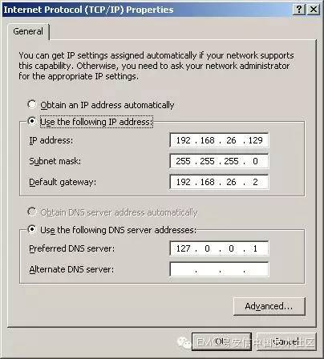
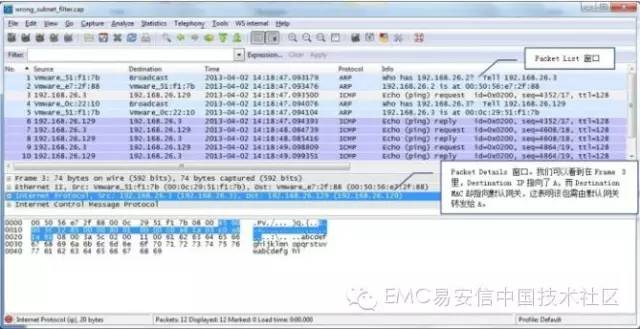

## Wireshark入门：第一次亲密接触

很多年前，当笔者还是少年的时候，就在家里搭建过Windows Domain， Linux与Windows相互共享，交换机和路由器的虚拟环境等。因为读书百遍，其义往往不能自见。唯有亲自动手，解决实验中碰到的问题，才可能真正学会一门技术。尤其是网络协议，很多时候自以为理解了，做过实验才知道是误解。时至今日，笔者早已变成大叔，但偶尔还做做实验，以验证自己对某些概念的理解是否有误。在客串当面试官时，也侧重考察应聘者对基本概念的理解深度，因为这决定了一名工程师的职业高度。比如下面这道面试题，考的都是基础概念，却经常难住应聘者。

**问题**：两台服务器A和B的网络配置如下，B的子网掩码本应该是255.255.255.0，不小心配成了255.255.255.224。这两台服务器还能正常通信吗？

A:

B：

很多应聘者都会沉思良久（他们一定在心里把我骂了很多遍了），然后给出形形色色的答案：

**答案1**： “A和B不能通信，因为……如果这样都行的话，子网掩码还有什么用？”（这位的反证法听上去很有道理！）
**答案2**： “A和B能通信，因为它们可以通过ARP广播获得对方的MAC地址。”（楼上的反证法用来反驳这位正好。）
**答案3**： “A和B能通信，但所有包都要通过默认网关192.168.26.2转发。”（请问这么复杂的结果你是怎么想到的？）
**答案4**： “A和B不能通信。因为ARP不能跨子网。”（这个答案听上去真像是经过认真思考的。）

以上哪个答案是正确的？还是没有一个正确？如果你是第一次听到这道题，建议仔细考虑一下（就算你本来是懂的，看了上面的答案后可能都被搞晕了）。

真相只有一个，应聘者的答案却如此五花八门，这还是最基础的路由交换问题。可见对网络概念的理解不容含糊，否则差之毫厘，谬以千里。问题是就算我们反复阅读网络教程，也不一定能悟出答案。这个时候就可以借助Wireshark的抓包与分析功能了。我已经在Vmware上安装了两台Windows server，并按照面试题配好网络。如果你以前没有用过Wireshark，就开始第一次亲密接触吧。

1. 从[http://www.wireshark.org/download.html]()免费下载安装包，并在服务器B上安装好（把所有可选项都装上）。

2. 打开Wireshark软件，点击菜单栏上的"Capture"，再点击“Interfaces”。服务器B上的所有网卡都会显示在弹出的新窗口上，对着要抓包的网卡点"Start"。

3. 在B上ping A的IP地址（结果，是通的！）。这个操作会被Wireshark记录在网络包里。

4. 在Wireshark的菜单栏上，点击“Capture”，然后点“Stop”。

5. （这一步并非必需，但存档是个好习惯）在Wireshark的菜单栏上，点击"File"，再点“Save”把网络包保存到硬盘上。

现在可以来分析网络包了。Wireshark的界面非常直观（如下图所示），无需大叔啰嗦，初学者根据Packet List窗口显示的Source, Destination, Protocol, Info等信息就能看懂。我们一起来看看Wireshark揭示了什么真相：

1. B通过ARP广播查询默认网关192.168.26.2的MAC地址。为什么ping的是A（192.168.26.129）的IP，它反而会去查询默认网关的MAC地址呢？这是因为在B看来，A属于不同子网，跨子网通信需要默认网关的转发。而要和默认网关通信，就需要获得其MAC地址。

2: 默认网关192.168.26.2向B回复了其MAC地址。你也许想知道为什么这些MAC地址的开头明明是00:50:56，为什么Wireshark显示出来是Vmware？这是因为MAC地址的前3个字节表示厂商。而00:50:56被分配给Vmware公司。这是全球统一的标准，所以Wireshark可以把前六位显示成厂商名。

3. B发出ping包，指定目标IP是A，但目标MAC却是默认网关（这个MAC地址在中间的窗口才能看到，我已经在图中标明）。这表明B希望默认网关把包转发给A。至于默认网关有没有转发，我们目前无从得知，除非在A上也抓个包。

4. B收到了A发出的ARP广播，这个广播查询的是B的MAC地址。因为在A看来，B属于相同子网。同子网通信无需默认网关的参与，只要通过ARP获得对方MAC地址就行了。这个包也表明默认网关成功地把B发出的ping请求转发给A了，否则A不会尝试和B通信。

5. B回复了A的ARP请求，把自己的MAC地址告诉A。这说明ARP协议并不考虑子网掩码，在ARP请求来自其他子网时，也照常回复。

6. B终于收到了A的ping回复。从下图划线的Src MAC地址我们可以看出，这个包是从A直接过来的，而不是通过默认网关。

7, 8, 9, 10: 都是重复的ping请求和ping回复。因为A和B已经获得对方的联系方式，所以就没必要再发ARP了。

分析完这几个包，真相大白。我们可以看到通信过程是这样的：B先把ping请求交给默认网关，默认网关再转发给A，而A收到请求后会直接把ping回复发给B，形成一个三角形的环路（你之前猜对了吗？）。如下图所示：

这不是一道纯粹的面试题。它不只考验应聘者对基础知识的掌握程度，在真实环境中也有用处。比如说，某台服务器的性能较差，就有可能是网络包走了错误的路径，而Wireshark就能帮我们找出原因。如果你希望进一步练习，不妨也搭个环境，把这道题里A和B的掩码互换一下。实验之前先想一想，这次还能ping通吗？

第一次亲密接触之后，对Wireshark有没有产生一些好感？这只是最简单的例子，如果你的工作跟网络相关，我相信你很快就会感受到Wireshark的更多魅力。而对笔者来说，Wireshark早就不只是贴心能干的助手（即便每天接受各种诡异问题的折磨，大叔目前还没有白发，谢谢Wireshark），而且还带来超乎阅读的愉悦。在接下来的一系列文章中，你将看到笔者是如何利用Wireshark，像柯南一样解决一个个看似不可能的案件的。